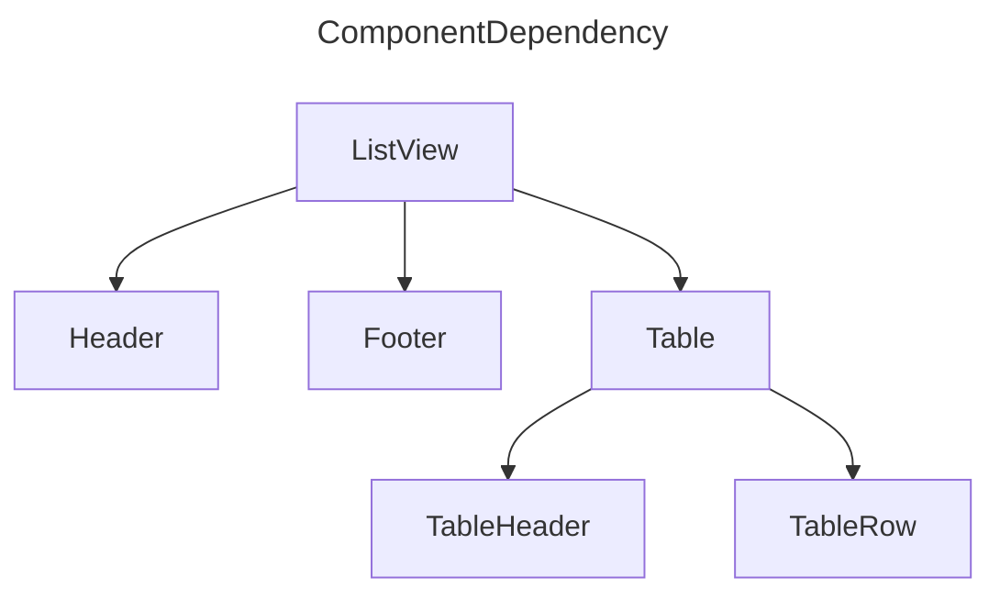

# viewtree

Tool to describe vue components dependency (as DOT,Mermaid format)

## installation

In repository root, install by deno.

```shell
deno task install
```

## usage(example)

```shell
# Linux
viewtree | dot -Tsvg -o temp.svg && xdg-open temp.svg

# MacOS
viewtree | dot -Tsvg -o temp.svg && open temp.svg
```

- specify directory path

```shell
viewtree <vue-project-path> | dot -Tsvg -o temp.svg && xdg-open temp.svg
```

- Mermaid format output

```shell
viewtree test/resource --format mermaid
```

output:


## for develop

### test

```shell
deno task test
```
